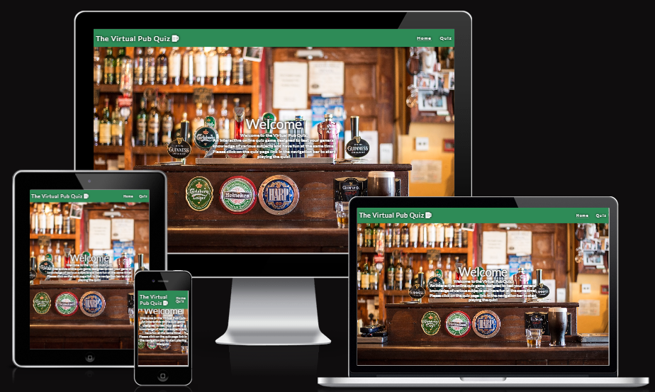

# The Virtual Pub Quiz

The Virtual Pub Quiz is an online interactive quiz game designed to test the user's general knowledge of varying subjects that you would normally find at a real in-person pub quiz.

The purpose of this project is to demonstrate a practical understading of how interactive front end development works in terms of DOM manipulation and to demonstate how the trinity of web development languages can interact with each other to create in this case a fun application for a lover of quiz apps.

 

[View the live site here](https://kdugg84.github.io/CI-The-Virtual-Pub-Quiz-MS2-GP/index.html)

---

## CONTENTS

* [User Experience](#user-experience-ux)
  * [User Stories](#user-stories)

* [Design](#design)
  * [Colour Scheme](#colour-scheme)
  * [Typography](#typography)
  * [Imagery](#imagery)
  * [Wireframes](#wireframes)

* [Features](#features)
  * [General Features on Each Page](#general-features-on-each-page)
  * [Future Implementations](#future-implementations)
  * [Accessibility](#accessibility)

* [Technologies Used](#technologies-used)
  * [Languages Used](#languages-used)
  * [Frameworks, Libraries & Programs Used](#frameworks-libraries--programs-used)

* [Deployment & Local Development](#deployment--local-development)
  * [Deployment](#deployment)
  * [Local Development](#local-development)
    * [How to Fork](#how-to-fork)
    * [How to Clone](#how-to-clone)

* [Testing](#testing)

* [Credits](#credits)
  * [Code Used](#code-used)
  * [Content](#content)
  * [Media](#media)
  * [Acknowledgments](#acknowledgments)

## User Experience (UX)

The best (intuitive) UX creates single-use learning.

### User Stories

* Website Owner's Goals:

  * I want new and returning players to use the quiz game.

  * I want users to be able to understand how to navigate the website.

  * I want the quiz game to be fun and educational.

  * I want the webpage/quiz game to function as it should.

  * I want users to return to the quiz game.

* First Time Visitor Goals: 

  * I want to be able to understand how the game works.

  * I want to be able to start playing the game quickly in as few steps as possible.

  * I want to be able to exit the game if need's be and return to the start menu.

  * I want to get my final score at the very end of the quiz. 

* Returning Visitor Goals:

  * I want to be able to start playing the game quickly in as few steps as possible.

  * I would like a choice of subjects and to be able to pick a subject of my choosing.

  * I want the gaming experience to be consistent with every use.

  * I would like an option to get random questions from random subjects. 
   
## Design

### Colour Scheme

I wanted the colours used for this project to reflect the interior appearance of a typical British or
Irish pub. In keeping with the theme of the pub quiz I used the following main colours:

* Seagreen: rgb(46, 139, 87)
* Saddlebrown: rgb(139, 69, 19)

The secondary colours used primarily in the quiz section are:

* Red: rgb(255, 0, 0)
* White: rgb(255, 255, 255)
* Black: rgb(0, 0, 0)

The secondary colours used alongside the green siding background of the quiz section help to generate a sense of playing a pub game. One very common game found in pubs is snooker or pool so the use of these three colours help reinforce this aspect of the quiz game.

### Typography

Google Fonts was used to import an external font style which was used as the main project font for the logo, the body
text and the questions and answers text. The Lato font was chosen to be the main font used throughout the project
as it is often regarded as a excellent choice for website. The text is clear and very readable compared to other 
font styles. The backup font style is sans-serif which is included in the CSS family-font selector in case the Lato font fails the load.

### Imagery

Imagery is important. The large, background/ hero image is designed to be striking and catch the user's attention and to help reinforce the nature of the application.

The background/hero image was downloaded from [Pexels](https://www.pexels.com), a simple search using the keyword "pub" 
and its the first hit on the first page, the image license is free to use (CC0). 

### Wireframes

The wireframes were created using Balsamiq desktop for Windows 10:

* [Home Page](assets/img/Home%20Page.png)

* [Quiz Page](assets/img/Quiz%20Page.png)

## Features

### General features on each page

The Virtual Pub Quiz consists of two pages "Home" and "Quiz".

* Features that are common across the site include:

  * A logo which acts as a link back to the home page.

  * A navigation bar which provides linkage to both pages.

  * Both the logo and navigation bar are responsive when viewed on different sized screens. 

  * The pub background/hero image is featured in both pages.

Other features of the Home Page:

* A welcome message which informs the user of what to expect from the quiz and an instruction
to click on the quiz navigation link to start playing the quiz.

The Quiz Page:

* A start quiz button which when clicked brings up a modal with a list of rules telling the user how 
to play the game.

* The modal includes two buttons, an exit button which returns the user back to the quiz page and a continue button 
to start playing the quiz.

* When the user clicks on the continue button the modal displaying the game instructions which disapear to be 
replaced by a scrolling green screen and another modal displaying the first questions.

* With each question the user has to pick one answer, a right answer will produce a white border around that question
and a wrong answer choice will highlight that question in red. The user must choose an answer before being able 
to continue with the quiz.

* Once the user has completed the quiz another modal will appear to present the user with their total score.

* The final score modal inclues to buttons were the user can either press "Try Again?" to retake the quiz 
and potenially improve their score or press "Go Home?" to return to the main quiz screen.

### Future Implementations

Future implementations could involve:

* Incorporating a trivia quiz API to generate the questions rather than having to manually type them out in an array file.

* The option to select from a list of subjects occording to the user's preferences.

* A randomiser mode where the app will generate the questions from different subjects.

### Accessibility

Whilst coding the site I have ensured that the site is accesible for all. This is achieve by using:

* Google Dev Tools to check contrast of items.
* Alt tags to describe the images on site.
* Semantic HTML.
* Aria Labels to hightlight areas for users who require the use of a screen reader.

## Technologies Used

### Languages Used

* HTML5
* CSS3
* JavaScript ES6

### Frameworks, Libraries & Programs Used

[Balsamiq](https://balsamiq.com/wireframes/) was used to create the wireframes for the website.
[Font Awesome](https://fontawesome.com/icons) was used to add the beer glass to the logo and the social media icons used in the footer.
[Google Fonts](https://fonts.google.com/) was used to import the font for the body text.
Google Dev Tools was used to identify and resolve problems related to responsiveness and appearance.
[Github](https://github.com/) was used to store my project in a repository.
[Git](https://git-scm.com/) was used for version control.
[Google](https://google.com) was used to research other CSS styles to add more dynamic touches to the
project and help with JavaScript functionality issues/problems. 
[Gitpod](https://www.gitpod.io/) the vast majority of my time was spent inside GitPod's VSCode Cloud IDE.
CDNs [Cloudflare](https://www.cloudflare.com/en-gb/learning/what-is-cloudflare/) and [JsDelivr](https://www.jsdelivr.com/) were used for Font Awesome icons CSS minified and Fork Awesome minified.
[Am I Responsive](https://ui.dev/amiresponsive) To create the responsive banner of devices.

## Testing

### Validation

The W3C Markup Validation Service was used on all pages as well as the CSS Validator:

* [HTML & CSS Validation Results](assets/img/Home-Quiz%20Page%20HTML%20&%20CSS%20Validation.PNG)
* [JSLint](https://jslint.com) was used to check for compliance with best coding practices.

The JS Lint validator throw up a few issues with my javaScript code, the two most commonly found were:

* "Use double quotes, not single quotes" when targeting CSS selector class.
* "Use 'function (...)', not '(...) =>' when arrow functions become too complex."

### Bugs and Errors

### Known Issues and Fixes

One known issue is regarding the quiz page when viewed at smaller screen sizes, at desktop there isn't a problem
but when the page is reduced in size the navigation bar is pushed out of view to the right. 

One solution I tried was using the overflow: hidden; property in CSS on the body element which only mitigated
the effect when viewed on desktop screen but I couldn't find a solution to the issue at smaller screen sizes. 

### Testing User Stories

* Website Owner's Goals:

  * I want users to be able to understand how to navigate the website.

    * Upon entering the home page the user is greeted with a welcome message and
    instruction to click on the quiz link in the navigation bar.

  * I want the quiz game to be fun and educational.

    * The questions presented to the user cover a wide range of subject rather than just
    sticking to one particular suject matter.

  * I want the webpage/quiz game to function as it should.

    * This falls into the section on manual testing where functionality is tested to make sure 
    that every aspect of the website works as intended.

  *  I want users to return to the quiz game.

    * This can be measured in terms of popularity and measuring the amount of user traffic that
    visits the site.  

* First Time Visitor Goals: 

  * I want to be able to understand how the game works.

    * When the user clicks on the quiz link in the navigation bar they are presented with a button
    which says "start quiz", once clicked a modal appears containing a list of rules and conditions the 
    user must follow in order to successfully complete the quiz.

  * I want to be able to start playing the game quickly in as few steps as possible.

    * Three clicks of a mouse is the total number of steps needed to start playing the quiz.

  * I want to be able to exit the game if need's be and return to the start menu. 

    *  There is no exit button built into the quiz section which allows for the user to exit
    before completing the quiz they have to get to the end before being able to exit.

  * I want to get my final score at the very end of the quiz.

    * When the quiz has been completed a modal will a appear with a final score tally.  

* Returning Visitor Goals:

  * I want to be able to start playing the game quickly in as few steps as possible.

    * Please refer back to point two under first time visitor goals.

  * I would like a choice of subjects and to be able to pick a subject of my choosing.

    * The quiz only comes with a list of pre-written questions from various subjects but a future 
    Implementation could be the option to choose from a list of different subjects from the main quiz page.

  * I want the gaming experience to be consistent with every use.

    * The quiz follows a logical order were the user can either exit or continue after clicking the start quiz
    button on the quiz page and if the user clicks continue they must answer the questions in the order
    they appear and will have the option to retake the quiz of return to the main quiz page at the end.   

  * I would like an option to get random questions from random subjects. 

    * This feature was mention in the future inplementations section and at this stage in the websites development
    the questions are only pre-written in the questions array and a randomiser option wasn't added to the program
    due in part to time constraints.    

### Further Testing

* The two pages that make up the site were tested using Chrome Developer Tools checking for responsiveness at 
the various different breakpoints to see how the site would react to being viewed on different devices.

* The website was viewed on various different devices such as Desktop, Laptop, Google Nexus 7 tablet and my Blackview BV6000 Android phone.

* Friends and family members were asked to review the site to highlight any bugs or user experience issues.

### Manual Testing

All throughout the development process as previously mentioned each page was consistently checked to make sure that they responded correctly to the various default breakpoints built into Chrome Developer Tools.

  * The logo was clicked in each page to make sure that it was correctly linked to the home page.

  * Each navigation bar link on each page was clicked to verify that it not only worked but took you to the correct page.

  * The quiz game was played serveral times during the development process with only five questions to make
  sure that the various functionality worked as expected and in the correct sequence of events. 

### Lighthouse

Results:

* [Home Page](assets/img/Home%20Page%20Lighthouse.PNG)
* [Quiz Page](assets/img/Quiz%20Page%20Lighthouse.PNG)

## Deployment & Local Development

### Deploying to Github Pages

* Choose the repository you want to deploy from the main overview.
* Go to settings by clicking on the icon on the menu.
* In the left navigation, select the "Pages" option.
* Under "Source", choose "Master" branch and click "Save".
* After it's done, you will see a message saying "Your site is ready to be published at (insert url here)".

### Local Development

#### How to Fork

Forking is the process of creating a copy of the original repository. The process allows a developer to make any changes without affecting the main repo.

To do this: 

* Search for the Github repo you want to copy.
* Select the "Fork" button located in the top right corner which is located under your profile icon.
* Once completed, you will now have your own version of that repo to make changes to.

#### How to Clone

To copy a Github repository:

* First navigate to the repository you wish to copy.
* Click on the "Code" button (which has a download icon) and copy the link provided. 
* In the Gitpod terminal, navigate to the directory where you want to place the clone. Then, type "git clone" and paste the link you copied earlier and press enter.
* Another way to push a cloned repository to a new Gitpod workspace can be done through the use of a Gitpod extension installed in your prefered browser, in my case Google Chrome. This browser extension will add a green Gitpod button to your Github account and will be visible on every repository created, cloned or searched for.

## Credits

### Code Used

* [Scrolling effect](https://css-tricks.com/books/fundamental-css-tactics/infinite-scrolling-background-image/)

###  Acknowledgments

* Jubril Akolade (My stand-in mentor for Chris) - for offering guidence and support for the project from it's inception, development and deployment.

* Code Institute student cohort on Slack - always offering help and solutions. 

* Callum Jones - for offering helpful advice and tips.